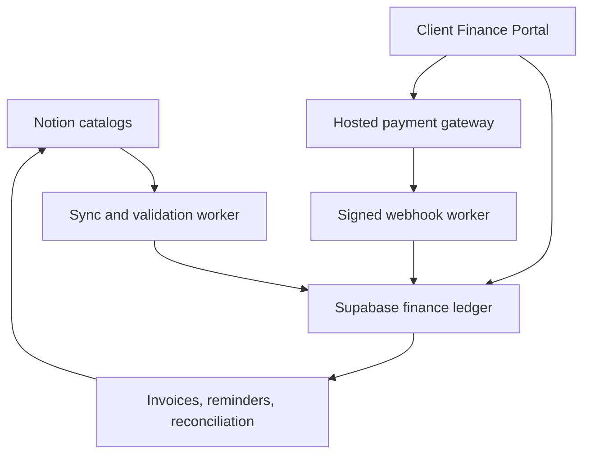

# KobePlay Finance Portal — Product and Architecture Specification

Status: Proposed  
Date: 2026-09-10  
Canonical operational project: [Notion project](https://app.notion.com/p/aa2256716a364a2eb22640f5651e0d4d)  
Implementation plan: [Notion plan](https://app.notion.com/p/3d7c65833c8881f6a04af0b4b970a490)

## Decision

Build one Finance Portal inside Open KobePlay for:

- client funding and non-withdrawable service credit;
- tools and subscription renewals;
- staff roles, compensation obligations, and approved payroll runs;
- invoices, receipts, reminders, reconciliation, reports, and audit events.

Notion remains the operational catalog and planning layer. Supabase is the transactional system of record. A licensed payment gateway owns hosted checkout, card tokenization, payment-method data, 3DS, and gateway webhooks.

Do not build a transferable or withdrawable wallet in v1.

## Confirmed source baseline

- Tools & Subscriptions: 14 current records totaling USD 507 per month, including a USD 35 trial record. All statuses, costs, and renewal dates require finance verification before invoicing.
- Staff & Salary: 8 active records. Seven entered weekly amounts total PHP 35,000 per week. IT Developer project and maintenance amounts are not yet approved.
- No placeholder or unverified amount may enter an invoice or payment run.

## Architecture

### Application

- Next.js + TypeScript + Tailwind/shadcn
- Supabase Postgres, Auth, Storage, RLS, and Edge Functions
- Background/scheduled workers for reminders, synchronization, PDF generation, and reconciliation
- Payment-provider adapter; PayMongo is the initial Philippine candidate, subject to merchant approval and capability verification

### Core tables

- `organizations`, `memberships`, `roles`
- `vendors`, `staff_profiles`, `compensation_terms`
- `subscriptions`, `subscription_cost_versions`, `renewal_events`
- `invoices`, `invoice_items`, `credit_notes`, `receipts`
- `payment_intents`, `payments`, `refunds`, `webhook_events`
- `credit_accounts`, `ledger_entries`
- `payroll_runs`, `payroll_items`, `approvals`
- `reminder_rules`, `notification_deliveries`
- `budgets`, `cost_centers`, `audit_events`, `evidence_links`

## Controls

- Store money as integer minor units plus ISO currency.
- Preserve original and reporting currency, exchange-rate source, and timestamp.
- Use immutable posted ledger entries; corrections use reversals or adjustments.
- Enforce idempotency on invoices, webhooks, credits, refunds, and payroll runs.
- Require maker-checker approval for payroll, refunds, manual credits, and high-value payments.
- Enforce organization-scoped RLS on every tenant-owned table.
- Verify webhook signatures before state changes.
- Keep card data, CVV, gateway secrets, KYC, OTPs, and private payment evidence out of Notion, GitHub, client logs, and general application tables.
- Daily reconciliation reports mismatches and never silently rewrites finance records.

## MVP screens

1. Finance Overview
2. Tools & Subscriptions
3. Staff & Positions
4. Invoices & Receipts
5. Add Credit / Pay Invoice
6. Payment Runs
7. Reports & Cost Audit
8. Approvals
9. Audit Log
10. Billing Settings

## Delivery

### Phase 0 — approve inputs

Confirm legal billing entity, BIR/tax treatment, invoice numbering, currencies, merchant gateway, service-credit treatment, approvers, thresholds, reminders, and payout rails. Verify every catalog amount.

### Phase 1 — usable finance dashboard

Implement auth/RLS, catalog sync, invoice generation, PDFs, manual payment evidence, reminders, dashboard reporting, and audit logging.

### Phase 2 — online payments

Implement hosted checkout, signed/idempotent webhooks, service-credit ledger, receipts, refunds, and reconciliation.

### Phase 3 — controlled payroll and integrations

Implement payroll runs, maker-checker approvals, payout export/adapter, notifications, Notion safe-summary sync, and accounting export.

## Release gates

- No duplicated webhook creates duplicate credit or payment.
- Invoice numbers and posted line items are immutable.
- Unverified costs are excluded.
- Salary data is restricted to finance-authorized roles.
- Reconciliation catches gateway/ledger/invoice mismatches.
- Security review, backup/restore test, staging E2E, and human production approval pass.
