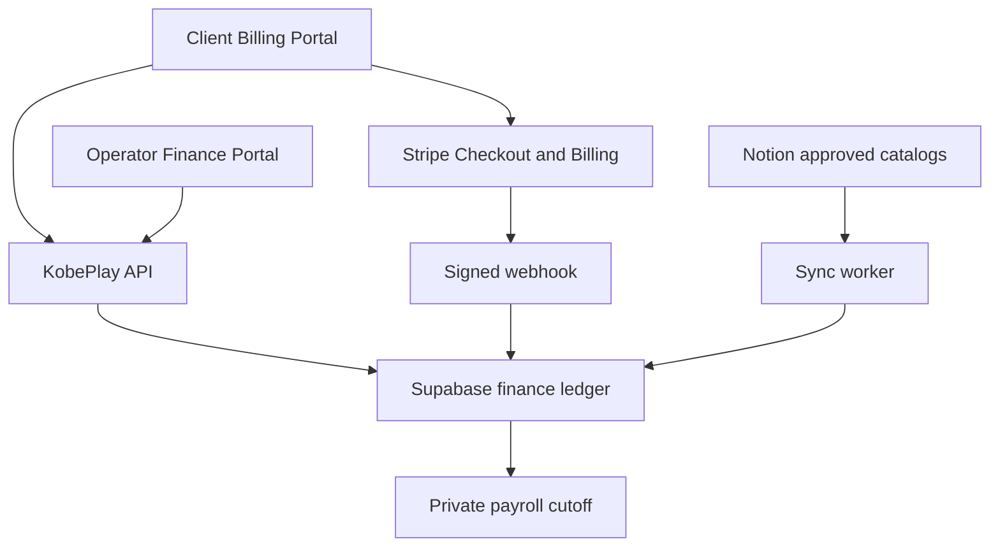

# KobePlay Client Billing and Operator Finance Portal

Status: Proposed  
Date: 2026-09-10  
Canonical project: [Notion](https://app.notion.com/p/aa2256716a364a2eb22640f5651e0d4d)  
Implementation plan: [Notion](https://app.notion.com/p/3d7c65833c8881f6a04af0b4b970a490)

## Business model

KobePlay is the operator and commercial middleman.

1. The operator contracts and invoices the client.
2. The client pays the operator or adds non-withdrawable service credit.
3. The operator pays tools, infrastructure, and staff from its own accounts.
4. Staff are paid on the operator's internal cutoff schedule.
5. Client revenue, vendor cost, payroll, payment fees, tax reserve, and operator margin are reconciled privately.

Clients never pay staff directly.

## Mandatory visibility boundary

### Client Billing Portal

Clients can see:

- approved service packages and assigned role/service coverage;
- managed tools or subscriptions charged to the client;
- invoice line items, tax, discounts, credits, receipts, due dates, and payment history;
- available service credit;
- Add Credit and Pay by Card;
- their own organization users and billing settings.

Clients must not see:

- individual staff salaries or payroll dates;
- internal tool/vendor costs;
- markup, commission, operator cut, profit, or gross margin;
- staff bank or e-wallet accounts;
- other clients or internal approval records.

### Operator Finance Portal

The operator can see and manage:

- client contracts, bill rates, invoices, collections, and receivables;
- true vendor costs and client tool charges;
- staff compensation, payroll accruals, cutoff periods, and payouts;
- platform/agency fees, markup, discounts, payment fees, tax reserve, and margin;
- approvals, refunds, adjustments, reconciliation, and audit events.

## Calculation model

Client invoice:

```text
managed_tools
+ service_packages
+ platform_or_agency_fee
+ approved_reimbursable_expenses
+ tax
- discount
- available_service_credit
= client_amount_due
```

Operator result:

```text
client_revenue
- payment_gateway_fees
- tool_and_infrastructure_cost
- staff_payroll_accrual
- approved_operating_expenses
- tax_reserve
= operator_contribution_margin
```

Never generate a client invoice by exposing the staff salary table. Convert internal costs into approved client service-package prices.

## Platform decision

### Payment layer: Stripe

Use Stripe first if the operator's Stripe account is active for the legal entity and intended business model:

- Stripe Checkout for card collection;
- Stripe Billing and Invoicing for one-time or recurring charges;
- signed webhooks for payment confirmation;
- Customer Balance Transactions for auditable invoice credits;
- Stripe Customer Portal only for safe billing functions.

Keep a provider adapter so another approved gateway can be added later.

### Transactional backend: Supabase

Use Supabase as the single production transactional backend:

- Postgres finance ledger;
- Auth and organization membership;
- RLS tenant isolation;
- Storage for generated invoice/receipt PDFs;
- Edge Functions for Stripe webhooks and secure server operations.

InsForge overlaps with Supabase because it also provides Postgres, authentication, storage, realtime, and functions. Do not operate two primary databases. Use InsForge only for prototyping, agent-assisted development, or a deliberate future migration.

### Remaining infrastructure

| Platform | Responsibility |
|---|---|
| GitHub | Source, migrations, CI/CD, review history |
| Cloudflare | DNS, WAF, CDN, rate limiting, optional frontend |
| Zeabur | Long-running API, scheduler, workers, PDF generation |
| Supabase | Transactional database, Auth, RLS, Storage, Edge Functions |
| Stripe | Checkout, cards, invoices, payment events |
| Notion | Approved catalogs, projects/tasks, safe summaries |
| Sentry | Application errors, traces, release monitoring |
| Secret manager | Stripe, Supabase, Notion, and deployment secrets |

## Architecture



Client and operator views use separate authorization policies even though they share the same accounting engine.

## Core data model

- `organizations`, `memberships`, `roles`
- `client_contracts`, `service_packages`, `client_price_versions`
- `vendors`, `tools`, `vendor_cost_versions`, `client_tool_charges`
- `staff_profiles`, `compensation_terms`, `payroll_cutoffs`, `payroll_items`
- `invoices`, `invoice_items`, `credit_notes`, `receipts`
- `stripe_customers`, `payment_intents`, `payments`, `refunds`, `webhook_events`
- `credit_accounts`, `ledger_entries`
- `expenses`, `tax_reserves`, `margin_snapshots`
- `approvals`, `reminder_rules`, `notification_deliveries`, `audit_events`

## Security rules

- Store money as integer minor units plus ISO currency.
- Use immutable posted ledger entries and reversing transactions.
- Enforce webhook signatures and idempotency keys.
- Keep operator-only fields out of client queries, serializers, exports, and logs.
- Apply Supabase RLS and server-side authorization; UI hiding alone is insufficient.
- Never store card numbers or CVV.
- Require approval for payroll runs, refunds, manual credits, price changes, and high-value payments.
- Reconcile Stripe, invoices, credit ledger, vendor costs, and payroll daily.
- Log actor, organization, action, previous state, new state, reason, and correlation ID.

## MVP release order

1. Operator configuration and verified pricing
2. Client and operator authentication/roles
3. Separate dashboards and RLS policies
4. Invoice generation and PDF receipts
5. Stripe Checkout and signed webhooks
6. Service-credit ledger
7. Recurring invoices and reminders
8. Private payroll cutoff and payout register
9. Reconciliation, margin reports, and audit log
10. Staging E2E, backup/restore test, and production approval

## Release gates

- A client API response contains no salary, vendor cost, or margin field.
- Duplicate webhooks never duplicate credit or payments.
- Client invoice prices come from approved price versions.
- Payroll remains a separate operator-private obligation.
- All posted finance events are traceable and reversible.
- No production payment activates before legal, tax, Stripe, and invoice rules are approved.
